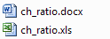

## ch-methylation 

Contact: mischa.lundberg at mater.uq.edu.au

*Tool for analysing CH methylation status of several sequences at once*

# Prerequisites:

|what | where | why |
|-----|-------|-----|
|java SE1.7 or newer | http://www.oracle.com/technetwork/java/javase/downloads/index.html | Runtime environment |

# Documentation:

The automatic cut-off is calculated by +3SD (mean + 3 * standard deviation).
The cut-off can be changed by changing the value of "Min percentage of methylation (0-100):" to something else than 0.

Main dialog : 

Drag and Drop your files, adjust the cut-off (min % of methylation) : 

Click calculate and see what happens : 

The output files will be stored in the same dir as your first dataset comes from : 

The Word file contains the complete sequences with Methylated nucleotides highlighted: 

The Excel file contains 
* Path of Alignment file 
* Name of Alignment file 
* Position of methylated nucleotide (0-Based)
* Distance to last methylated (significant) nucleotide (or to the start of the sequence) 
* Sequence +/- 4 nucleotides from the methylated nucleotide 
* The preset cut-off for insignifant methylation stages 
* Count of methylated nucleotides over the spartial sequences 
* Number of sequences used for Alignment 
* Percent of methylation 
 

# Steps of further development:

* Reading .ab1 files
* Showing chromatograph for selecting parts to exclude
* Automaticaly detect parts to exclude

# Report an Issue
If you have any questions or suggestion, please feel free to contact me (mischa.lundberg at mater.uq.edu.au), create an issue or send a pull request.

## Don't forget to cite
